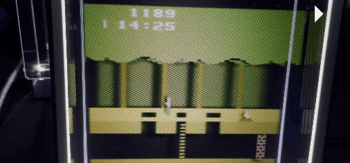
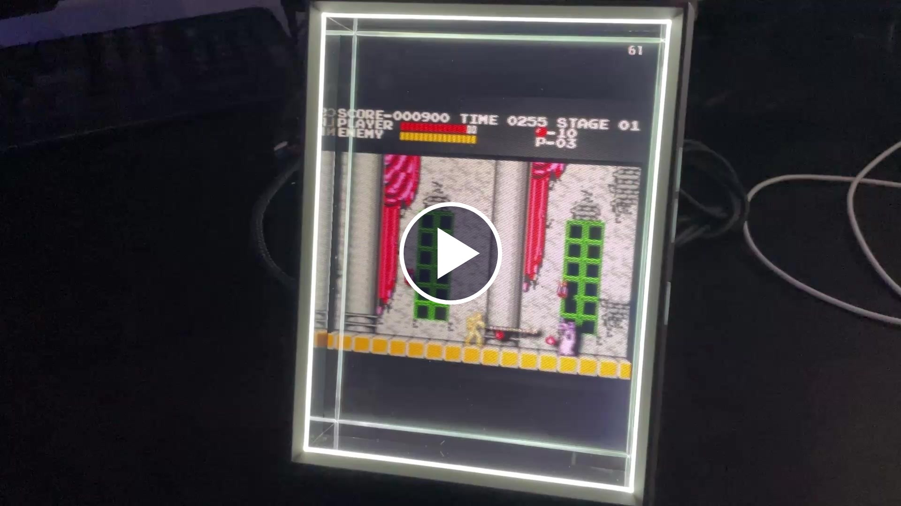
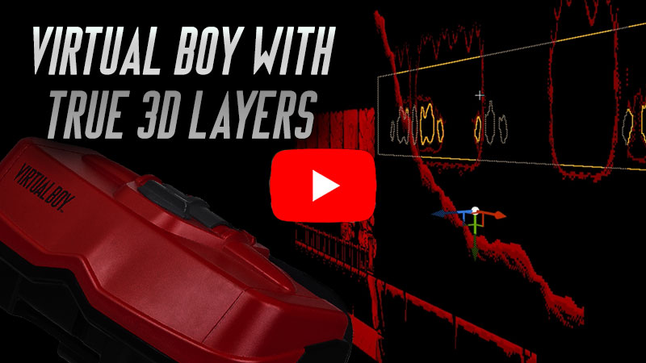

# HoloVCS

Atari 2600, NES, and Virtual Boy games rendered as stacked 3D layers, and Nintendo 3DS games rendered in true per-pixel 3D, on Looking Glass holographic displays.

## What is it?

HoloVCS turns classic games into small 3D dioramas. Instead of displaying a single 2D emulator image, it separates backgrounds, platforms, characters, effects, and foreground objects into textured layers placed at different depths. On a Looking Glass display, the result can be viewed from different horizontal angles without glasses or a headset.

The Nintendo 3DS goes further: its games are real 3D scenes already, so on a Looking Glass the customized core re-renders each game from a slightly different camera position for every view the display shows. That is true per-pixel 3D rather than a layered diorama.

The Looking Glass build has been tested on three devices:

- Looking Glass Portrait
- Looking Glass Go
- Original 8.9-inch Looking Glass

Also note that the 3D effects mostly only work with a couple hand-tweaked games at the time of this writing. (The exceptions are Virtual Boy and Nintendo 3DS, which are inherently 3D, so every game gets real depth)

## Features

- Atari 2600, NES, Virtual Boy, and Nintendo 3DS emulation through customized libretro cores.
- Hand-tuned 3D profiles for supported Atari 2600 and NES games, identified by checksum rather than filename.
- Native Virtual Boy depth layers captured directly from the customized Beetle VB core.
- Nintendo 3DS support: a customized Azahar-based core renders true multiview 3D from the emulated GPU's real geometry, so games need no hand-tuned profiles.
- Layered lighting, shadows, backdrop images, adjustable depth, save states, keyboard controls, and gamepad support.
- A customized Looking Glass Unreal Engine 5.8 plugin with automatic device calibration and a project-specific high-speed quilt renderer.
- Complete HoloVCS, emulator-core, and Looking Glass plugin source included in this repository.

The custom sprite-quilt renderer reduced the measured render-thread cost of generating a quilt from about 85 ms to 0.7 ms, roughly 100 times faster than the plugin's general scene-capture path for this project. It achieves that speed by drawing HoloVCS's known stack of textured rectangles directly instead of rendering a complete Unreal scene for every view. It is not a general-purpose replacement for the normal Looking Glass renderer and falls back to that renderer when a scene does not meet its constraints.

## Nintendo 3DS support

Unlike the 2D systems, the 3DS is a true 3D console, so no hand-tuned per-game profiles are needed. The customized core renders true multiview 3D: the scene is re-rendered from a slightly different camera position for every view the display shows, so every pixel carries its real depth instead of being assigned to a layer. The bottom screen appears on its own panel below the 3D scene, with touch input driven by the mouse or gamepad.

The core is based on [Azahar](https://github.com/azahar-emu/azahar), the open-source continuation of Citra; the modified source lives on the `holo` branch of [SethRobinson/azahar](https://github.com/SethRobinson/azahar). Like the other cores it is GPL-2.0 and remains a separate DLL loaded at runtime. The core accepts only decrypted ROM dumps, and as with the rest of HoloVCS, no ROMs, encryption keys, or decryption capability are included.

## Videos

**Super Mario Bros. and Castlevania**

**Virtual Boy**

## Latest versions

### Version 1.5 - August 28, 2026

- Added Nintendo 3DS support through a customized Azahar core: on the Looking Glass every game renders in true multiview 3D with real per-pixel depth (not stacked layers), so no per-game profiles are needed. Includes the bottom screen on its own panel, a mouse or stick driven touch cursor, analog circle pad support, and save states.
- Mario Kart 7 and other games that render through padded buffers now get full 3D instead of a flat hologram.
- Landscape displays like the original 8.9-inch Looking Glass show one 3DS screen at a time: B swaps to the bottom screen, and holding the left trigger peeks at it.
- 3DS dumps that are merely flagged as encrypted (common with dumping tools) now load automatically; only genuinely encrypted dumps are refused, with a clear on-screen message. A failed ROM load now recovers cleanly instead of leaving a broken display, and keeps the reason on screen.
- Switching ROMs with , and . is debounced with a Loading message, so you can skip past large 3DS games without waiting for each one to load.
- The F and G keys now save and load state directly as documented, and the savestate hotkeys say so on systems without savestate support instead of failing silently.
- The 3D depth defaults to 175% on the 3DS for better framing on the device; depth, convergence, and zoom tweaks now reset to each game's own defaults when switching games. `\` instantly toggles between 2D and 3D.
- Added a debug fly camera (V key, or hold the left stick click and press the right stick click) and scripted camera moves for capturing footage. On a Looking Glass, the fly camera flies the hologram itself so you can view the diorama layers from any angle (the frame rate drops while flying and recovers on exit).
- Gamepad system hotkeys now chord off the left stick click instead of Start, so using them no longer opens the game's Start menu: hold the left stick click and press LB/RB for save/load state, LT/RT for previous/next game, Y to pause, or X to toggle fast-forward.
- Looking Glass calibration is now cached per device, so a wedged calibration read (it can happen after an abnormal exit) no longer requires a reboot to get a picture.

### Version 1.4 - August 20, 2026

- Ported HoloVCS and its customized Looking Glass plugin to Unreal Engine 5.8.
- Added the complete modified source for all three emulator cores to the repository.
- Added a layer profile for Legend Of Zelda (NES).
- Added much faster project-specific quilt rendering and self-rendered Looking Glass output for smoother play.
- Confirmed support on the Looking Glass Portrait, Looking Glass Go, and original 8.9-inch Looking Glass, and improved checksum-based ROM startup.

## Download and play

Download the ready-to-run Looking Glass Windows build: [HoloVCS_Win64.zip](https://www.rtsoft.com/files/HoloVCS_Win64.zip).  (The executable/dlls are codesigned by me, Seth A. Robinson)

The release does not contain copyrighted game ROMs. Put your own `.a26`, `.nes`, `.vb`, and `.3ds`/`.cci` files in the `atari2600`, `nes`, `vb`, and `3ds` directories respectively. (3DS dumps must be decrypted.)

HoloVCS recognizes games by ROM checksum instead of filename, so you can name the files anything, but the revision has to match. These are the exact versions with hand-tuned 3D layer profiles:

| Directory | Game | ROM version |
| --- | --- | --- |
| `atari2600` | Pitfall! | `Pitfall! (1982) (Activision) [!].a26` |
| `nes` | Super Mario Bros. | `Super Mario Bros. (World).nes` |
| `nes` | Castlevania | `Castlevania (USA) (Rev A).nes` |
| `nes` | Tetris | `Tetris (USA).nes` |
| `nes` | The Legend of Zelda | `Legend of Zelda, The (PRG 1).nes` |
| `vb` | Virtual Boy Wario Land | `Virtual Boy Wario Land (Japan, USA).vb` |
| `vb` | Jack Bros. | `Jack Bros.vb` |

Any Virtual Boy or Nintendo 3DS game works, no per-game profile needed: the customized Beetle VB and Azahar cores hand HoloVCS real depth layers. Other Atari 2600 and NES games load and play fine, they just get default layering instead of a hand-tuned depth effect.

Press `,` or `.` in the game to switch between the ROMs you installed; the full control list is in the next section (and on the `?` key in the game).

HoloVCS requires a connected Looking Glass display and [Looking Glass Bridge](https://lookingglassfactory.com/software-downloads).

## Controls

Press `?` in the game at any time to show this list; any key closes it.

Game controls:

| Input | Action |
| --- | --- |
| WASD / Arrows / left stick | Move / D-pad (Circle Pad on 3DS) |
| Gamepad D-pad | D-pad (3DS: camera etc.) |
| Space | A button |
| Ctrl / left click | B button |
| C / Z | X / Y buttons (3DS) |
| Q / E | L / R buttons |
| Enter | Start |
| Tab | Select |
| Mouse / right stick | Touch cursor (3DS) |
| Left click / right trigger / right stick click | Touch tap (3DS) |
| B or hold left trigger | Swap to / hold the bottom screen (3DS on landscape displays) |

System:

| Input | Action |
| --- | --- |
| , / . | Previous / next game |
| R | Reset game |
| P | Pause |
| F / G | Save / load state (L also loads) |
| Hold left stick click + LB / RB | Save / load state (pad) |
| Hold left stick click + LT / RT | Previous / next game (pad) |
| Hold left stick click + Y | Pause (pad) |
| Hold left stick click + X | Frameskip 4 on/off (pad fast-forward) |
| V or click both sticks | Fly camera on/off |
| D-pad while flying | Magnify / pan left-right |

View and rendering:

| Input | Action |
| --- | --- |
| [ / ] | Less / more 3D depth |
| \ | Toggle 2D / 3D |
| { / } | Convergence: pop-out amount (3DS) |
| ; / ' | Peel layers (3DS: hold to cut away) |
| = / - | Zoom in / out |
| 0 | Toggle FPS cap |
| 1 through 5 | Frameskip |
| 6 / 7 / 8 | Texture smoothing / shadows / lighting |
| Shift+1 through Shift+7 | Debug views: wireframe / clay / unlit / depth / heat / rainbow / x-ray |
| Shift+0 | Debug views off |

## Looking Glass integration

The project uses Unreal Engine 5.8. `HoloVCS.uproject` enables the vendored, UE 5.8-ported Looking Glass plugin in `Plugins/LookingGlass` and renders to Looking Glass hardware. No separate Unreal plugin download is required.

The [upstream Looking Glass Unreal plugin](https://github.com/Looking-Glass/Looking-Glass-Unreal-Plugin) does not currently ship official UE 5.8 support, so this repository carries the tested port and its HoloVCS-specific rendering improvements.

## Build from source on Windows

Everything HoloVCS-specific needed to compile is checked into this repository, including the complete modified source for all three emulator cores and the Looking Glass plugin. There are no submodules or Git LFS source dependencies.

Prerequisites:

- Unreal Engine 5.8
- Visual Studio 2022 or newer with Desktop development with C++, the MSVC v143 toolset, and a Windows 10 or 11 SDK
- Looking Glass Bridge 2.5.1 or newer
- Your own legally obtained ROMs for runtime testing

Build steps:

1. Run `BuildCores.bat`. It builds all three libretro DLLs from `cores/` and copies them to `Binaries/Win64`.
2. Right-click `HoloVCS.uproject` and choose **Generate Visual Studio project files**.
3. Open `HoloVCS.sln`, select **Development Editor**, and build `HoloVCSEditor`.
4. Open `HoloVCS.uproject`, or run one of the Shipping build scripts below.

Useful scripts:

- `BuildAndRunWin64LKG.bat` incrementally stages and launches the Looking Glass Shipping build for local testing. Pass `nolaunch` to build without launching.
- `PackageWin64LKGRelease.bat` performs a clean Looking Glass release stage, rebuilds the cores, signs the executables and core DLLs, excludes ROMs and save states, and creates `HoloVCS_Win64.zip`.

The local test stage includes ROMs from your working directories and must never be distributed. The release packaging script only copies the placeholder text files from the ROM directories.

## Emulator cores and licensing

The patched core sources are vendored under `cores/`:

- `cores/stella`: Atari 2600, based on [Stella](https://github.com/stella-emu/stella), with selective VCS hardware-sprite rendering. The project-specific changes are also captured in [StellaModification.dif](StellaModifications/StellaModification.dif).
- `cores/fceumm`: NES, based on [FCEUmm](https://docs.libretro.com/library/fceumm), with controllable background and sprite rendering plus HoloVCS layer metadata.
- `cores/beetle-vb`: Virtual Boy, based on [Beetle VB](https://github.com/libretro/beetle-vb-libretro), returning pre-split 3D layers through `mednafen/vb/HoloVB.h`.

The Nintendo 3DS core is based on [Azahar](https://github.com/azahar-emu/azahar) and is maintained on the `holo` branch of [SethRobinson/azahar](https://github.com/SethRobinson/azahar) rather than under `cores/`.

HoloVCS code and media use the BSD-style attribution license in [LICENSE.md](LICENSE.md). The emulator cores are GPL-2.0 projects with their own license files. They remain separate DLLs loaded at runtime so GPL code is not linked into the Unreal binary. The vendored Looking Glass plugin is MIT licensed.

ROMs are not included.

## AI Disclosure (applies to code written in August 2026+)

This project was developed with assistance from AI tools. I mean, you can still blame me (Seth) for bugs, but just wanted to mention it.

## Credits

- Written by Seth A. Robinson (my sites: [rtsoft.com](https://www.rtsoft.com/) and [Codedojo](https://www.codedojo.com/))
- Atari 2600 emulation via [Stella](https://github.com/stella-emu/stella)
- NES emulation via [FCEUmm](https://github.com/libretro/libretro-fceumm)
- Virtual Boy emulation via [Beetle VB](https://github.com/libretro/beetle-vb-libretro)
- A big thanks to Looking Glass Factory for making their [Unreal plugin](https://github.com/Looking-Glass/Looking-Glass-Unreal-Plugin) open source
- Moon image by Stephen Rahn under a [public-domain license](https://www.flickr.com/photos/srahn/16542943668/in/photostream)
